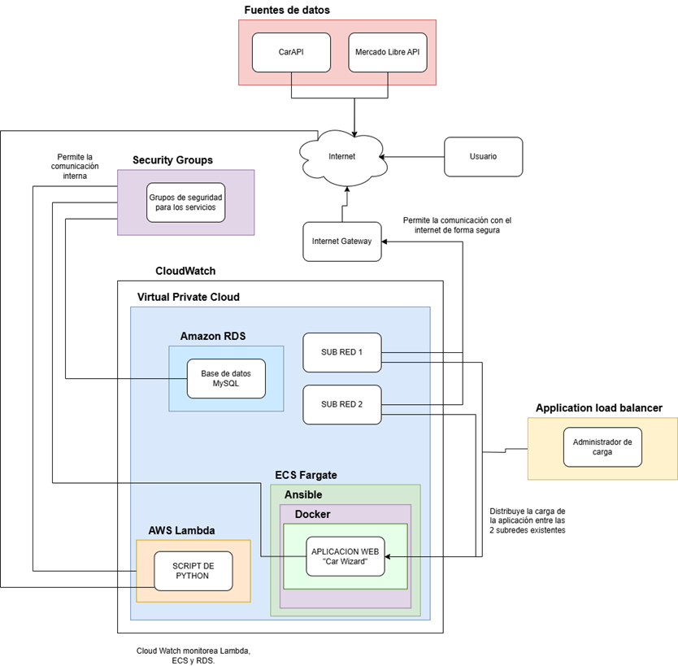

# 🚗 CarWizard - Fase II: Construcción

**📌 Repositorio:** [CarWizard en GitHub](https://github.com/PabloDoria/Car-Wizard)

## 📖 Descripción
CarWizard es una página web que permite consultar datos financieros, técnicos y propiedades de autos de marcas populares. Los usuarios pueden filtrar por marca, precio, financiamiento y consumo.

## 🔧 Proceso de Desarrollo
1. **Obtención de Datos:** Scripts en Python extraen y limpian datos de CAR API.
2. **Base de Datos:** Implementación en **MySQL** para gestionar datos de los vehículos.
3. **Contenedores ECS:** Aplicación desplegada en **Docker + ECS** en AWS.
4. **Ejecución de Scripts:** Uso de **AWS Lambda** para procesar datos.
5. **Infraestructura como Código (IaC):** Terraform configura todos los servicios en la nube.
6. **Desarrollo Web:** Página web en **PHP con el framework Artisan**.
7. **Automatización CI/CD:** Despliegue automático con **GitHub Actions + Terraform**.

## 🏗️ Infraestructura en AWS
- **VPC y Subnets:** Red privada con dos subnets en **us-east-1a** y **us-east-1b**.
- **ECS Fargate:** Despliegue de contenedores sin servidores.
- **ECR:** Almacenamiento de imágenes Docker.
- **ALB (Application Load Balancer):** Balanceo de carga para ECS.
- **RDS (MySQL):** Base de datos en Amazon RDS con acceso restringido.
- **AWS Lambda:** Procesamiento de datos con Python.
- **CloudWatch:** Monitoreo y logging de la infraestructura.

## 🔁 Ciclo de Despliegue Automatizado
1. **GitHub Actions** detecta cambios en la rama `main`.
2. **Terraform** levanta o actualiza la infraestructura.
3. Se construye y sube la imagen Docker a **ECR**.
4. **ECS** actualiza la aplicación con la nueva imagen.
5. **ALB** dirige el tráfico a los contenedores activos.
6. **CloudWatch** registra logs y monitorea el sistema.

## ⚙️ Infraestructura Definida en Terraform
- `networking.tf`: Configuración de la **VPC, subnets y grupos de seguridad**.
- `ecs.tf`: Definición del **clúster ECS, servicio y tareas**.
- `ecr.tf`: Repositorio para imágenes Docker.
- `cloudwatch.tf`: Monitoreo y logging con **CloudWatch**.
- `rds.tf`: Configuración de la **base de datos MySQL en RDS**.
- `lambda.tf`: Definición de **AWS Lambda** para procesamiento de datos.
- `alb.tf`: Configuración del **Application Load Balancer (ALB)**.

## 🛠️ Asignación de Responsabilidades
- **Luis Mario Quintanilla:** Desarrollo web, diseño de interfaz y selección de funciones clave.
- **Ana Daniela:** Diseño y estructura de la base de datos en MySQL.
- **Pablo & Ángel:** Obtención de datos y configuración de la infraestructura en AWS.

---

## 📌 Diagrama de Arquitectura

---
🚀 **CarWizard busca diferenciarse mediante gráficos y visuales interpretativos que ayuden a los usuarios a tomar mejores decisiones al comprar un automóvil.**
